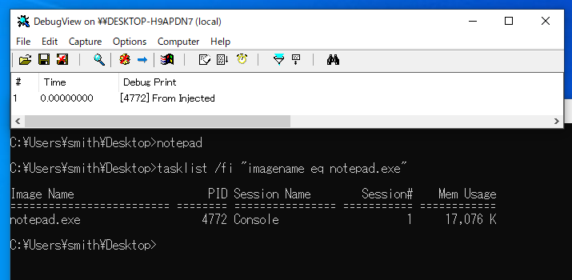

## overview
This is APC injection to a application from kernel.  
Default target is notepad.exe with test.dll.  

## environment
- VS2019
- Windows10 x64 20H2
- Only 64bit

## reference
- http://rce4fun.blogspot.com/2019/04/circumventing-windows-defender-atps.html
- https://securelist.com/moonbounce-the-dark-side-of-uefi-firmware/105468/ (technical document)